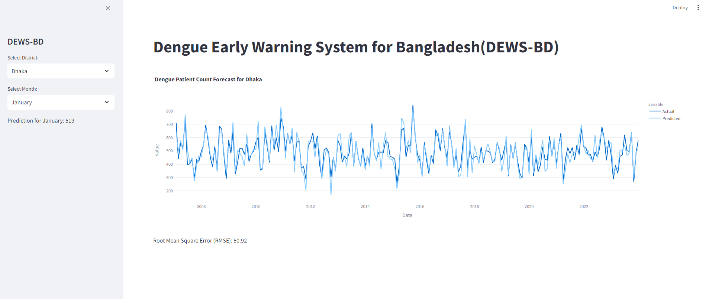

# Dengue Early Warning System for Bangladesh ( DEWS-BD)

## Project Overview
DEWS-BD is an advanced early warning system designed to predict and mitigate dengue outbreaks in Bangladesh. By leveraging data science and machine learning techniques, DEWS-BD aims to provide accurate and timely predictions, enabling public health officials and policymakers to take proactive measures in combating dengue.

## Key Features
- **Localized Data Analysis:** Tailored to handle and analyze data specific to the climatic and demographic conditions of Bangladesh.
- **Integration with Health Systems:** Designed to seamlessly integrate with Bangladesh's health infrastructure for real-time data updates.
- **Predictive Analytics:** Utilizes machine learning models to predict dengue outbreaks and identify high-risk areas.
- **User-Friendly Interface:** Provides an intuitive interface for health professionals to access and interpret data.

## Objectives

The primary objectives of the DEWS-BD project are:
- To develop a reliable and scalable early warning system for dengue outbreaks.
- To integrate multiple data sources, including climatic data, mosquito population data, and health records, for comprehensive analysis.
- To employ machine learning algorithms for accurate prediction of dengue outbreaks.
- To provide actionable insights for public health officials and policymakers to prevent and control dengue outbreaks.

## Methods

The DEWS-BD project utilizes a combination of data collection, preprocessing, and machine learning techniques to achieve its objectives. Key methodologies include:
- **Data Collection:** Aggregating data from various sources such as weather reports, mosquito surveillance data, and hospital records.
- **Data Preprocessing:** Cleaning and transforming the data to ensure quality and consistency.
- **Machine Learning:** Implementing algorithms such as logistic regression, random forests, and neural networks for outbreak prediction.
- **Validation:** Evaluating the performance of the models using metrics like accuracy, precision, recall, and the F1 score.

## DEWS-BD Interface

This project is ongoing and continuously updated to incorporate new data sources and improve prediction accuracy.

## Acknowledgements

We would like to acknowledge the following organizations for their invaluable support and contributions to the DEWS-BD project:

- **Bangladesh Meteorological Department (BMD):** For providing the crucial meteorological data that underpins our predictive models and enables accurate forecasting of dengue outbreaks.
- **Directorate General of Health Services (DGHS):** For supplying the dengue case data, which is essential for training and validating our machine learning models and ensuring the reliability of our predictions.
